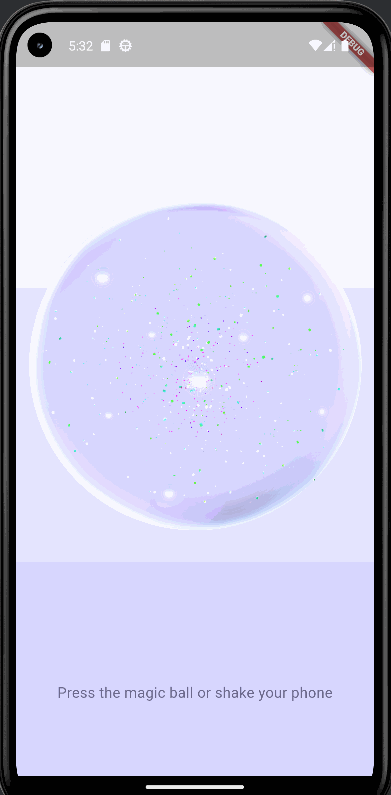
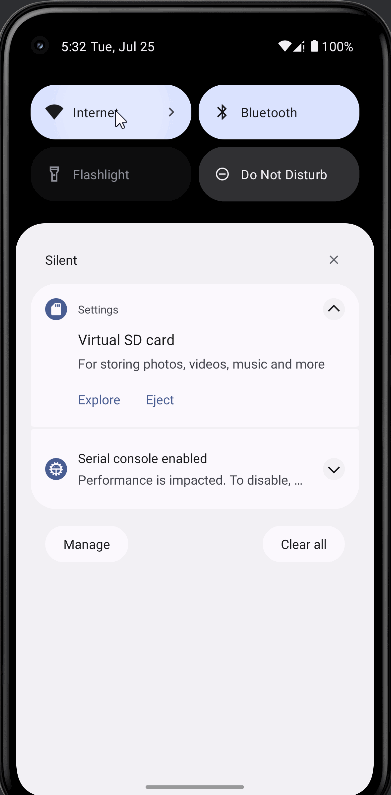

# Целевая платформа

Платформа: Android (работает на iOS, но также виджеты использованы такие чтобы например в web-версии интерфейс растягивался корректно)

# Результаты

## Задание 1

Реализован интрефейс экраа с магическим шаром (и небольшой инструкцией)

## Задание 2

Реализованы классы для логической сущности и для отображения магического шара

## Задание 3

Реализовано выполнение API call по нажатию на шар и обработка результата
(п.с. оказалось сложно реализовать это с помощью FutureBuilder, но, как показали поиски, для такой простой функциональности это было бы лишним)

## Задание 10

Добавлена анимация для текста инструкций и внутри шара (имитация печати)

# Ссылки на демонстрацию работы/скриншоты

Анимации и получение предсказания:

ПОлучение ошибки:

